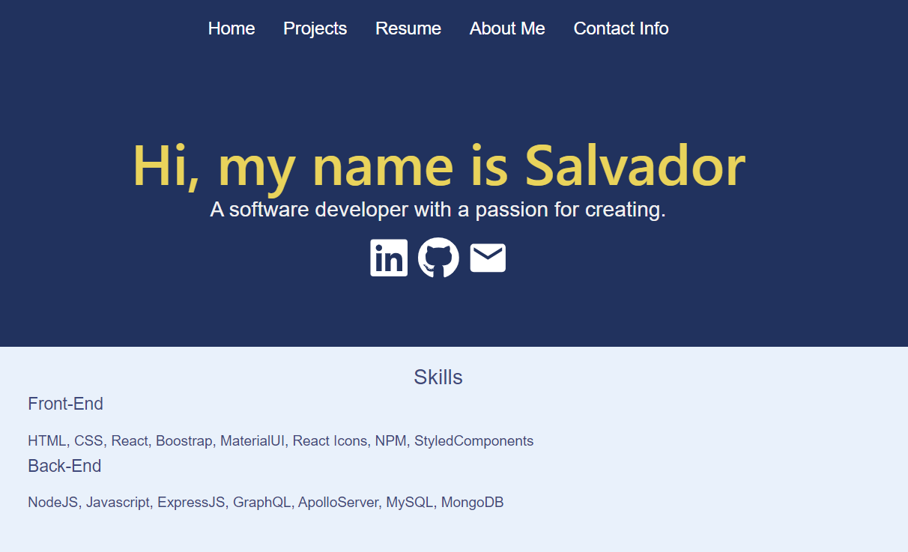

# My Portfolio 3000

## Description

- This is my portfolio where I showcase my progression from a beginner to a Software Engineer. My motivation for creating this project was to have a place where all my projects can be showcased and accessed. Additionally, I will integrate my resume and add functionality for messaging me if there are any questions. Building this project was challenging; I encountered several hurdles, specifically when I faced issues that I had to resolve on my own. Some of the minor issues involved bugs and using outdated plugins. Overall, it was a great experience that I hope will help me break into the Software Engineering field.

## Installation

- No installation is required for this project unless you would like to have your own copy. If you do, follow the link at the bottom and navigate to my repository. There you can clone a copy and customize it to fit your style.

## Usage

- To use this app, follow the provided link to access the live hosted site showcasing my portfolio. The first page that appears is the "About" section, where you will find some details about my journey so far.
  

- Next, you will see the Navbar, allowing you to navigate to each page. I have five pages so far: Home, Projects, Resume, About Me, and Contact Info, each displaying details about me.
  

- Lastly, the homepage includes my name and links to some of my professional sites. Here you will also find the skills I possess.
  

## Features

- Some of the key features of this project include its responsiveness, allowing you to view the mobile version. Additionally, you can download my resume and contact me via email.

## Links

- Github: https://github.com/Sal1316
