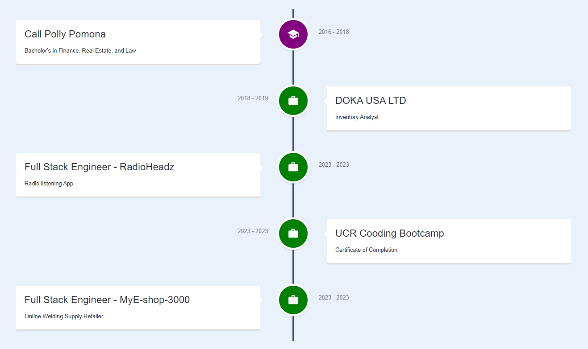
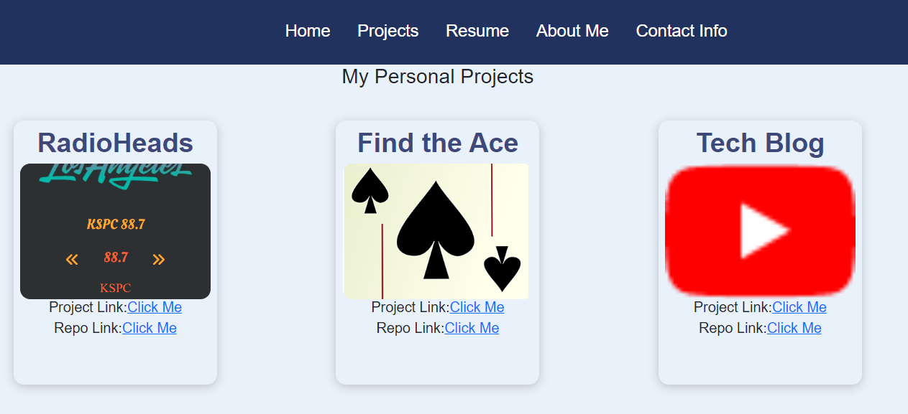

# My Portfolio 3000

## Description

This is my portfolio. It is where I will showcase my progression from a beginner to a Software Engineer. My motivation for creating this project was to have a place where all my projects can be showcased and accessed. Also, I will Integrate my resume and give it functionality to be able to message me back if there are any queatios.  Building this project was not easy, there was a couple heardles I had to overcome, specifically, when I ran into issues I had to figure them out myself. Some of the minor issues was the bugs and using outdated plugins. Overall, this was a great experiecne, taht I hope will help me to breack into the Software Engineering field.

## Installation

There is no installation requred for this project, unless you would like to have your own copy. If you do, then follow the link at the bottom and navigate to my repo. There you can clone a copy and adjust it to fit your style. 

## Usage

To use this App, you can follow the link provided to take you to a live hosted site where the my portfolio is hosted. The first page that apears is the about section, where you will find some details about my journed so far. 

Next, you will see the Navbar where you can navigate to the to each page. So far I have, five pages, Home, Projects, Resume, About Me, and Contact Info which all show some details about me. 

## Credits

List your collaborators, if any, with links to their GitHub profiles.

If you used any third-party assets that require attribution, list the creators with links to their primary web presence in this section.

If you followed tutorials, include links to those here as well.

## License

The last section of a high-quality README file is the license. This lets other developers know what they can and cannot do with your project. If you need help choosing a license, refer to [https://choosealicense.com/](https://choosealicense.com/).

---

🏆 The previous sections are the bare minimum, and your project will ultimately determine the content of this document. You might also want to consider adding the following sections.

## Badges

Badges aren't necessary, per se, but they demonstrate street cred. Badges let other developers know that you know what you're doing. Check out the badges hosted by [shields.io](https://shields.io/). You may not understand what they all represent now, but you will in time.

## Features

If your project has a lot of features, list them here.

## How to Contribute

If you created an application or package and would like other developers to contribute it, you can include guidelines for how to do so. The [Contributor Covenant](https://www.contributor-covenant.org/) is an industry standard, but you can always write your own if you'd prefer.
